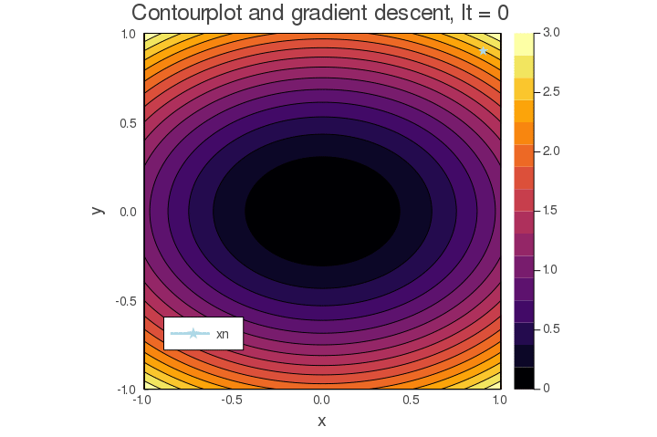

# Julia for scientific computing

A quick introduction to Julia essentials by programming the gradient descent algorithm and other cool examples. Designed specifically for those using Python/Matlab for scientific computing that want to learn the basics of Julia to start coding in this language as soon as possible, without having to go through all the details at first. 

## Installation

This introduction is given in the form of Jupyter Notebooks. The easiest way to follow the course is by visiting [the Binder build of the Notebooks](https://mybinder.org/v2/gh/ismedina/julia-scientific-computing/master); that way you don't have to install anything. However, if you want to install Julia in your computer and run the course locally you can take a look at the following guide: https://datatofish.com/add-julia-to-jupyter/, and then clone the repo.

